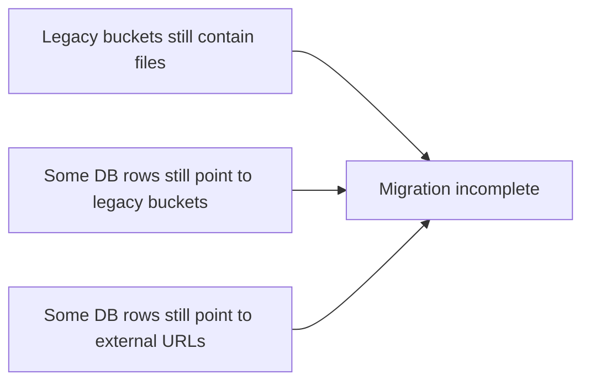
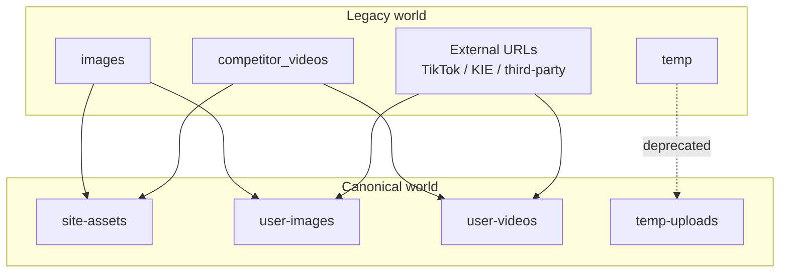
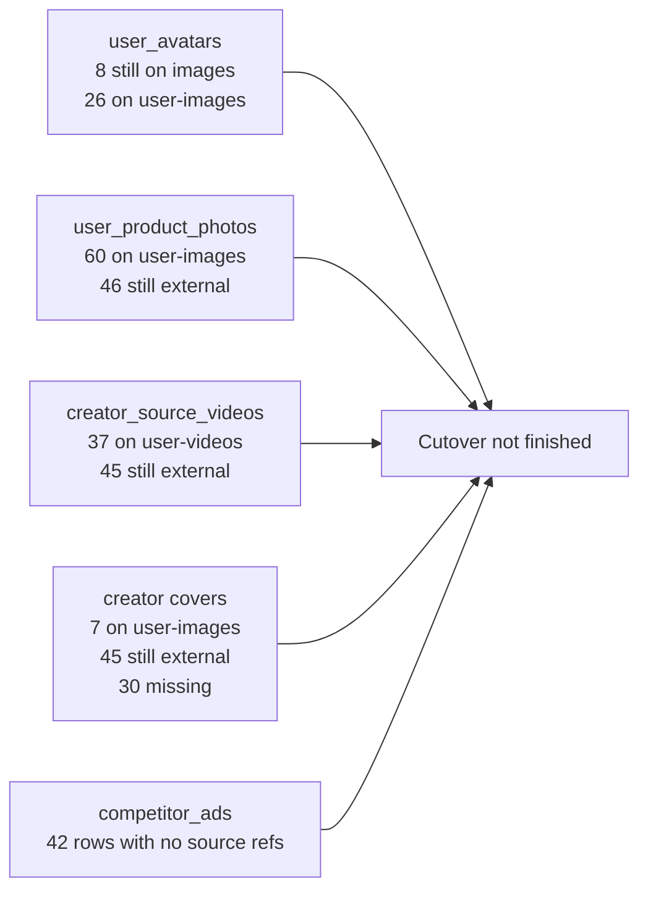

# Storage Cutover Migration Overview

Last verified: 2026-03-02

## TL;DR

The legacy storage migration is **not complete yet**.

There are still:

- legacy files physically present in old buckets
- database rows still pointing to legacy buckets
- database rows still pointing to external third-party URLs instead of canonical Flowtra buckets

## Current Conclusion

## Buckets

### Canonical buckets

- `site-assets`
- `user-images`
- `user-videos`
- `temp-uploads`

### Legacy buckets

- `images`
- `competitor_videos`
- `temp`

## Physical File Status

These are object counts currently present in Supabase Storage buckets.

| Bucket | Role | Object count | Meaning |
| --- | --- | ---: | --- |
| `images` | legacy | 390 | Old image bucket still contains many files |
| `competitor_videos` | legacy | 147 | Old video bucket still contains many files |
| `temp` | legacy | 0 | Looks effectively unused now |
| `user-images` | canonical | 131 | New canonical image bucket in active use |
| `user-videos` | canonical | 43 | New canonical video bucket in active use |
| `temp-uploads` | canonical temp | 0 | No files at the time of verification |

## Database Reference Status

### 1. `user_avatars`

| Storage target | Count |
| --- | ---: |
| `storage_bucket = images` | 8 |
| `storage_bucket = user-images` | 26 |

Interpretation:

- avatar migration is **partially complete**
- 8 avatar records still reference the legacy `images` bucket

### 2. `user_product_photos`

| Storage target | Count |
| --- | ---: |
| `storage_bucket = user-images` | 60 |
| `storage_bucket = null` | 46 |
| `photo_url` is external URL | 46 |

Interpretation:

- 60 product photos are canonicalized
- 46 product photos are still stored as external URLs rather than canonical Flowtra storage
- this is mainly the purification flow gap

### 3. `creator_source_videos`

#### Video refs

| Storage target | Count |
| --- | ---: |
| `storage_bucket = user-videos` | 37 |
| `storage_bucket = null` | 45 |
| video ref is external URL | 45 |

#### Cover refs

| Storage target | Count |
| --- | ---: |
| `cover_storage_bucket = user-images` | 7 |
| `cover_storage_bucket = null` | 75 |
| cover URL is external URL | 45 |
| cover URL is null | 30 |

Interpretation:

- creator video migration is **partially complete**
- newer imported/uploaded videos are already in `user-videos`
- many historical creator videos still rely on external URLs
- cover image persistence is even less complete than video persistence

### 4. `competitor_ads`

| Storage target | Count |
| --- | ---: |
| `source_storage_bucket = null` | 42 |

Interpretation:

- competitor ad source media is **not being retained canonically**
- current historical rows do not have stored source media refs in canonical storage

## Migration Flow

This is the intended target architecture for the cutover.

## Current Real-World State

## What Has Already Been Migrated

- Part of `user_avatars` has moved from `images` to `user-images`
- Part of `user_product_photos` has moved into `user-images`
- Part of `creator_source_videos` has moved into `user-videos`
- Part of creator video covers has moved into `user-images`
- New canonical buckets are already live and receiving writes

## What Has Not Finished Yet

- old files in `images` still exist
- old files in `competitor_videos` still exist
- some avatars still point to `images`
- some product photos still point to external URLs
- many creator source videos still point to external URLs
- many creator source covers are still missing canonical storage refs
- competitor ad source videos are not yet retained canonically

## Practical Bottom Line

If your question is:

> "Have the old storage files already been migrated to the new storage?"

The accurate answer is:

**No, not fully.**

The system is in a mixed state:

- part of the data is already using the new buckets
- part of the data is still on legacy buckets
- part of the data is still outside Flowtra storage entirely and only saved as external URLs

## Recommended Read Of The Situation

Think of the migration as three layers:

1. **Buckets created**: done
2. **New writes mostly going to new buckets**: partially done
3. **Historical data and references fully rehosted and normalized**: not done yet

That means the cutover infrastructure exists, but the migration cleanup is still incomplete.
