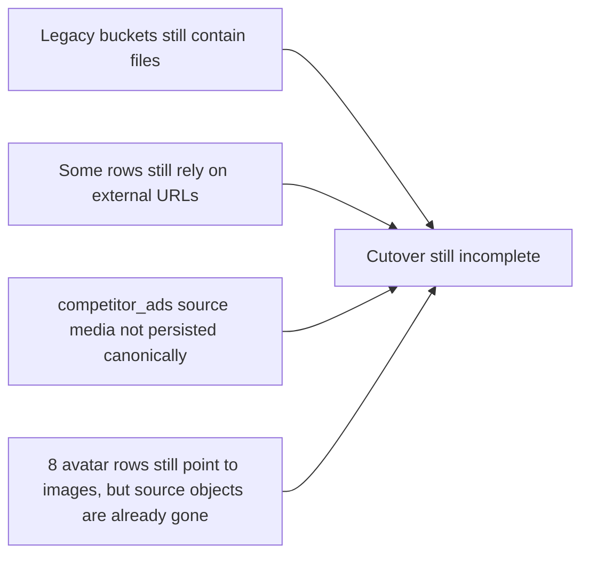
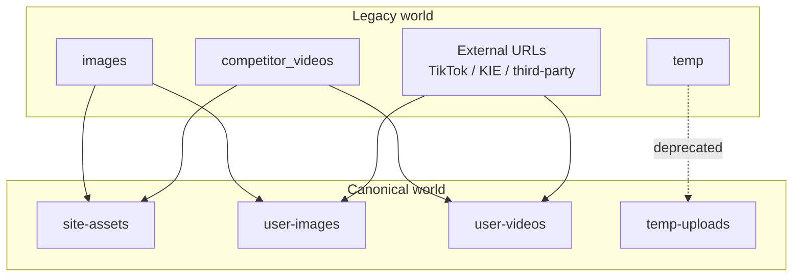
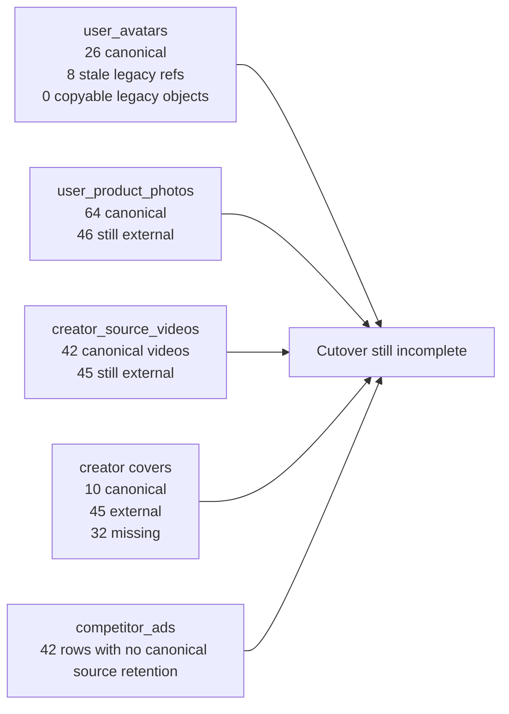

# Storage Cutover Migration Overview

Last verified: 2026-03-03

## TL;DR

The storage cutover is still **incomplete overall**, but the situation is more specific than "old bucket refs still exist".

As of 2026-03-03:

- legacy buckets still physically contain files
- some database rows still use external third-party URLs instead of canonical Flowtra buckets
- `competitor_ads` source media is still not retained canonically
- the only business-table rows still pointing at a legacy bucket are 8 `user_avatars` rows, and all 8 point to legacy objects that no longer exist

## Current Conclusion

## Buckets

### Canonical buckets

- `site-assets`
- `user-images`
- `user-videos`
- `temp-uploads`

### Legacy buckets

- `images`
- `competitor_videos`
- `temp`

## Physical File Status

These are object counts currently present in Supabase Storage buckets.

| Bucket | Role | Object count | Meaning |
| --- | --- | ---: | --- |
| `images` | legacy | 390 | Old image bucket still contains legacy objects |
| `competitor_videos` | legacy | 147 | Old video bucket still contains legacy objects |
| `temp` | legacy | 0 | Effectively unused now |
| `user-images` | canonical | 138 | New canonical image bucket in active use |
| `user-videos` | canonical | 48 | New canonical video bucket in active use |
| `temp-uploads` | canonical temp | 0 | No files at verification time |
| `site-assets` | canonical static | 95 | Static/site assets already rehomed here |

## Canonical Target Paths

These are the path patterns the codebase currently uses for migrated assets.

| Table / asset | Canonical bucket | Canonical path |
| --- | --- | --- |
| `user_avatars` primary | `user-images` | `users/{sanitized_user_id}/avatars/{avatar_id}/primary/original.{ext}` |
| `user_avatars` references | `user-images` | `users/{sanitized_user_id}/avatars/{avatar_id}/references/reference-{nn}.{ext}` |
| `user_product_photos` | `user-images` | `users/{sanitized_user_id}/products/{product_id}/photos/{photo_id}/{original\|purified}.{ext}` |
| `creator_source_videos` source video | `user-videos` | `users/{sanitized_user_id}/creator-videos/{creator_video_id}/source/original.{ext}` |
| `creator_source_videos` cover | `user-images` | `users/{sanitized_user_id}/creator-videos/{creator_video_id}/cover/original.{ext}` |
| `competitor_ads` source video | `user-videos` | `users/{sanitized_user_id}/competitor-ads/{competitor_ad_id}/source/original.{ext}` |

## Database Reference Status

### Verification rule used in this report

A row is only considered "still migratable from a legacy bucket" if both are true:

1. the row still points to a legacy bucket
2. the exact legacy object still exists in `storage.objects`

If the row points to a legacy bucket but the old object is already gone, that is treated as a **stale database reference**, not remaining copy work.

### 1. `user_avatars`

| Storage state | Count |
| --- | ---: |
| `storage_bucket = user-images` | 26 |
| `storage_bucket = images` and source object still exists | 0 |
| `storage_bucket = images` but source object is missing | 8 |

Interpretation:

- avatar migration is functionally complete from a file-copy perspective
- there is **no remaining avatar row** whose old `images` object can still be copied
- the remaining 8 rows are stale legacy references and need data cleanup or manual remapping, not normal bucket migration

### 2. `user_product_photos`

| Storage state | Count |
| --- | ---: |
| `storage_bucket = user-images` | 64 |
| `storage_bucket = images` and source object still exists | 0 |
| `storage_bucket = images` but source object is missing | 0 |
| `storage_bucket = null` | 46 |
| `photo_url` is external URL | 46 |

Interpretation:

- there are **no remaining product photo rows** still attached to the legacy `images` bucket
- the remaining gap is not old-bucket migration
- the remaining 46 rows need external URLs to be rehosted into `user-images`

### 3. `creator_source_videos`

#### Video refs

| Storage state | Count |
| --- | ---: |
| `storage_bucket = user-videos` | 42 |
| `storage_bucket = competitor_videos` and source object still exists | 0 |
| `storage_bucket = competitor_videos` but source object is missing | 0 |
| `storage_bucket = null` | 45 |
| video ref is external URL | 45 |

#### Cover refs

| Storage state | Count |
| --- | ---: |
| `cover_storage_bucket = user-images` | 10 |
| `cover_storage_bucket = competitor_videos` and source object still exists | 0 |
| `cover_storage_bucket = competitor_videos` but source object is missing | 0 |
| `cover_storage_bucket = null` | 77 |
| cover URL is external URL | 45 |
| cover URL is null | 32 |

Interpretation:

- there are **no remaining creator video rows** still attached to a copyable legacy `competitor_videos` object
- the main unfinished work is still external rehosting
- cover persistence is behind source video persistence

### 4. `competitor_ads`

| Storage state | Count |
| --- | ---: |
| `source_storage_bucket = user-videos` | 0 |
| `source_storage_bucket = competitor_videos` and source object still exists | 0 |
| `source_storage_bucket = competitor_videos` but source object is missing | 0 |
| `source_storage_bucket = null` | 42 |

Interpretation:

- competitor ad source media has not been canonically retained yet
- there is currently **no migrated historical footprint** in `user-videos` for this table
- this is a product/data-retention gap rather than a leftover copy-from-legacy-bucket job

## Migration Flow

This is the intended target architecture for the cutover.

## Current Real-World State

## What Has Already Been Migrated

- `user_avatars` primary canonicalization is established and actively used
- `user_product_photos` no longer has active legacy-bucket references
- `creator_source_videos` no longer has active legacy-bucket references
- creator video covers are partially canonicalized into `user-images`
- new canonical buckets are live and receiving writes
- static/site asset migration into `site-assets` is underway

## What Has Not Finished Yet

- old files in `images` still exist
- old files in `competitor_videos` still exist
- 8 `user_avatars` rows still carry stale `images` references even though the old objects are gone
- 46 `user_product_photos` rows still point to external URLs
- 45 `creator_source_videos` rows still point to external video URLs
- 45 creator video covers still point to external URLs
- 32 creator video covers are still missing altogether
- `competitor_ads` source videos are not yet retained canonically

## Practical Bottom Line

If your rule is:

> "Only count files that still physically exist in the old buckets and still need to be migrated"

Then the accurate answer is:

**Yes. The remaining migratable old-bucket files for the checked user-media flows have already been migrated.**

In other words:

- there is **no remaining row** that still points to a legacy bucket **and** still has a surviving legacy object ready for copy-based migration
- rows that still mention old buckets but whose old objects are already gone are stale historical references, not pending file migration
- the remaining work is now mostly:
  - stale DB cleanup
  - external URL rehosting
  - missing source retention for `competitor_ads`

## Recommended Read Of The Situation

Think of the migration as three layers:

1. **Buckets created**: done
2. **New writes mostly going to new buckets**: largely done
3. **Historical data and references fully normalized**: still not done

That means the cutover infrastructure exists, and the remaining work is now less about raw bucket-to-bucket copying and more about reference cleanup plus canonical rehosting of externally hosted media.
